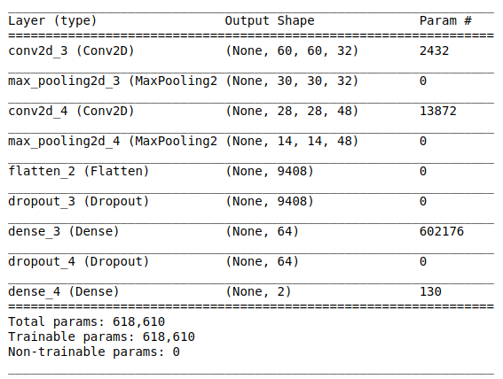
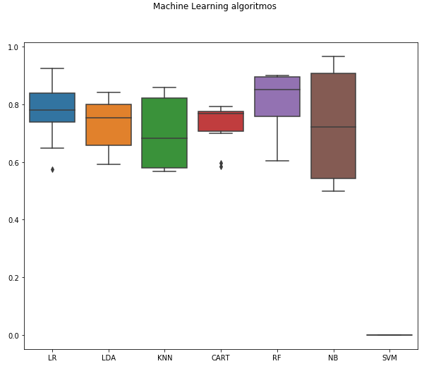
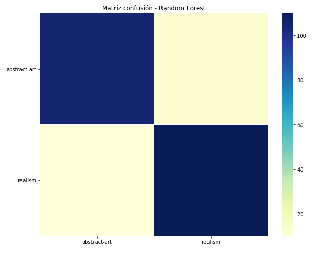

# art_classification

## Descripción

El objetivo del proyecto es entrenar un módelo que pueda diferenciar estilos 
de pinturas.

En un principio se optó por cuatro estilos (abstracto, realismo, surrealismo y pop-art). Dado que las métricas obtenidas estaban entre un 55 y 63 por ciento.
Se decidió entrenar al módelo con dos estilos diferentes (abstracto, realismo).
Para posteriormente ir aumentando el número de estilos.  

En este proyecto podemos ver el desarrollo para diferenciar dos estilos de arte  

## Datos utilizados

Las imágenes han sido obtenidas de la siguiente url:
[wikiart.org](https://www.wikiart.org)  

Se han obtenido:  
 2400 para el train  
 480 para el test  
 480 para la validación y pruebas posteriores   

Además de las imágenes se han guardado el autor, título de la obra y el año de esta.  

## Procedimiento

## Estructura del repositorio

**/**: Archivos de jupyter notebook, durante el desarrollo del proyecto
**api/** : Api web  
**data/**: Archivos csv con información sobre las imágenes  
**features/** : Features obtenidas de las imágenes  
**training/** : Archivos donde se almacena el entrenamiento de los modelos  
**images/** : Imágenes informativas para el readme   

## Anotaciones

## Mejoras

Unas de las mejoras principales es conseguir un modelo que pueda diferenciar 
al menos cuatro estilos de pinturas.

## Otras cuestiones

